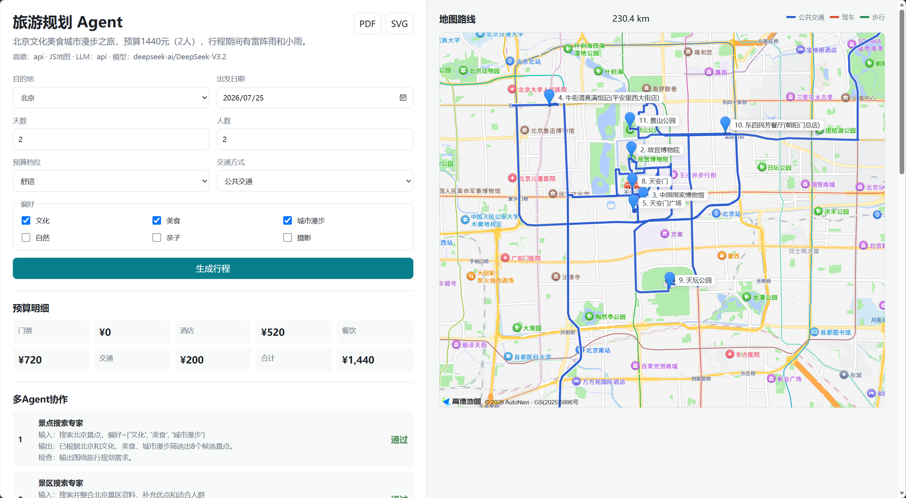
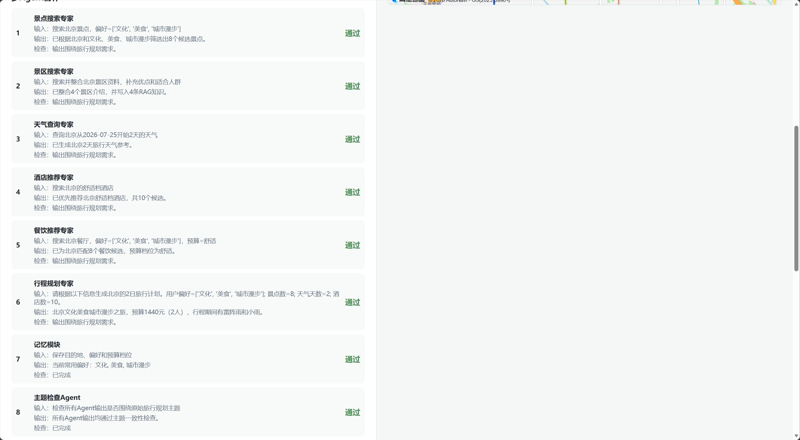
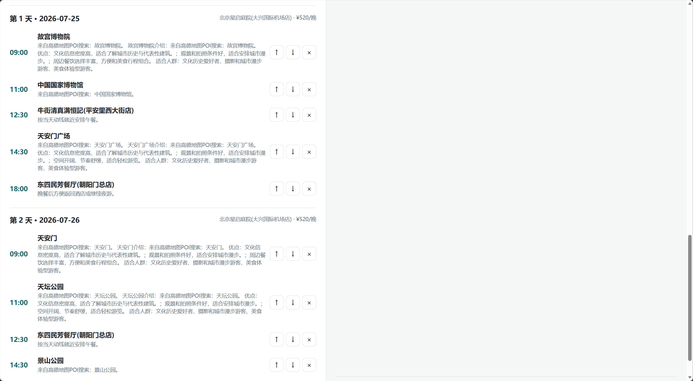

# 旅游规划 Agent

这是一个基于 FastAPI + 多 Agent 的旅游规划应用。系统把旅行规划拆成多个专家角色，由总控 Agent 协调，并额外加入“主题检查 Agent”确保每个子 Agent 的输出没有脱离用户最初的旅行规划话题。


## 运行截图

### 旅游规划主界面



### 多 Agent 协作过程



### 行程规划结果



> 提示：生成行程前，请先访问 `/api/health` 检查高德地图、LLM、Qdrant 和 SerpApi 的配置状态。生成完成后，可在 Agent 协作过程和接口返回结果中查看景区搜索来源；`source` 为 `serpapi` 表示已使用真实搜索，`rag_added` 大于 `0` 表示景点知识已成功写入 Qdrant。

## 项目结构

```text
travel-plan-agent/
├── backend/
│   └── app/               # FastAPI 后端：API 路由、请求模型、静态前端挂载
├── travel_agent/
│   ├── core/              # 核心框架层：Agent、消息、异常、env配置、LLM客户端
│   ├── agents/            # 多 Agent：景点、天气、酒店、规划、检查、总控
│   └── tools/             # 工具系统层：高德POI、天气、预算、地图、导出
├── app/                   # 前端页面，由 FastAPI 静态托管
├── tests/                 # 测试
├── .env                   # 本地密钥配置
├── .env.example           # 配置模板
├── requirements.txt       # 依赖库
└── README.md
```

## 环境需求

- Python 3.10 或更高版本。
- 可选：高德地图 Web 服务 Key；不填写时后端使用本地示例数据。
- 可选：高德地图 Web端 JS API Key 与安全密钥；不填写时前端使用备用 SVG 地图。
- 可选：OpenAI 兼容 LLM API Key；不填写时使用规则生成总结和建议。
- 可选：Qdrant 云服务 URL 与 API Key；不填写时跳过 RAG 景点知识库。
- 可选：SerpApi API Key；不填写时景区搜索 Agent 使用规则总结回退。
- 如需调用真实高德或 LLM 服务，需要可访问外网的运行环境。

## 依赖库

安装后端运行和测试所需依赖：

```bash
pip install -r requirements.txt
```

依赖包括：

- `fastapi`：构建后端 API。
- `uvicorn`：启动 FastAPI 服务。
- `pytest`：运行测试。

后端结构参考了完整项目的分层方式：`api/routes` 放接口，`models` 放请求/响应模型，`services` 放业务服务，`travel_agent` 保持多 Agent 核心逻辑。

## API 配置

项目已经生成 `.env` 和 `.env.example`。把你的真实 Key 填入 `.env` 即可：

```env
AMAP_API_KEY=你的高德地图Web服务Key
AMAP_TIMEOUT=10

AMAP_JS_API_KEY=你的高德地图Web端JS API Key
AMAP_JS_SECURITY_CODE=你的高德地图Web端JS安全密钥
AMAP_JS_EXPOSE_SECURITY=true
AMAP_JS_SERVICE_HOST=

# Qdrant RAG 景点知识库
QDRANT_URL=https://your-cluster.qdrant.tech:6333
QDRANT_API_KEY=your_qdrant_api_key_here
QDRANT_COLLECTION=travel_attraction_knowledge
QDRANT_TIMEOUT=10

# SerpApi 景区搜索
SERPAPI_API_KEY=your_serpapi_api_key_here
SERPAPI_TIMEOUT=15

LLM_API_KEY=你的LLM_API_KEY
LLM_BASE_URL=https://api.openai.com/v1
LLM_MODEL=gpt-4o-mini
TRAVEL_AGENT_USE_LLM=true
```

说明：

- `AMAP_API_KEY`：用于高德 Web 服务 API，景点/酒店搜索走 POI 关键字搜索，天气和后端路线规划也会使用它。
- `AMAP_JS_API_KEY`：用于前端加载高德 Web端 JavaScript API 2.0，让页面显示真实地图。
- `AMAP_JS_SECURITY_CODE`：高德 Web端 JS API 的安全密钥。高德说明中提到，2021-12-02 之后创建的 Key 需要配合安全密钥使用。
- `AMAP_JS_EXPOSE_SECURITY`：开发演示可设为 `true`，前端会按高德“明文设置”方式使用 `securityJsCode`；生产环境建议设为 `false` 并配置 `AMAP_JS_SERVICE_HOST`。
- `AMAP_JS_SERVICE_HOST`：生产环境代理服务地址，用于高德推荐的代理转发方式，格式示例为 `https://你的域名/_AMapService`。
- `QDRANT_URL`：Qdrant 云服务地址，例如 `https://your-cluster.qdrant.tech:6333`。
- `QDRANT_API_KEY`：Qdrant Cloud API Key，用于写入和检索景点向量知识库。
- `QDRANT_COLLECTION`：景点知识库 collection 名称，默认 `travel_attraction_knowledge`。
- `SERPAPI_API_KEY`：SerpApi API Key，用于景区搜索 Agent 检索网页资料。
- `SERPAPI_TIMEOUT`：SerpApi 请求超时时间，默认 15 秒。
- `LLM_BASE_URL`：使用 OpenAI 兼容接口，默认是 OpenAI；如果使用 DeepSeek、ModelScope、阿里云百炼等，把这里换成对应的 `/v1` 地址。
- `LLM_MODEL`：填写你要调用的模型名。
- 未填写后端高德 Key 时，系统会自动回退到本地示例数据；未填写前端 JS Key 时，页面会回退到备用 SVG 地图。

高德 Web端 JS API 安全配置参考官方文档：https://lbs.amap.com/api/javascript-api-v2/guide/abc/jscode

### SerpApi 景区搜索 Agent

`ScenicSearchAgent` 会调用 SerpApi Google Search API 搜索景区资料，将搜索摘要整合为“景点优点”和“适合人群”，再写入 Qdrant RAG 知识库。SerpApi 官方文档说明 Google Search API 端点为 `https://serpapi.com/search?engine=google`，其中 `q` 是搜索词，`location` 可指定搜索城市。

未配置 `SERPAPI_API_KEY` 时，该 Agent 不会中断流程，会基于已有景点标签和理由生成规则化介绍，并在 Qdrant 可用时写入 RAG。

### Qdrant RAG 景点知识库

项目内置了一个小型景点知识库，包含两个目的地、每个目的地两个景点：

- 上海：外滩、上海博物馆。
- 北京：故宫博物院、天坛公园。

配置 `QDRANT_URL` 和 `QDRANT_API_KEY` 后，`AttractionSearchAgent` 会优先把这些知识写入 Qdrant collection，并通过 RAG 检索与目的地、偏好最相关的景点；如果 Qdrant 未配置或调用失败，会自动回退到高德 POI 和本地数据。

## 运行方式

进入项目目录：

```bash
cd D:/课程设计/travel-plan-agent
```

安装依赖：

```bash
pip install -r requirements.txt
```

启动 FastAPI 后端和前端页面：

```bash
python -m uvicorn backend.app.main:app --reload --host 127.0.0.1 --port 8000
```

打开应用页面：

```text
http://127.0.0.1:8000/
```

打开 API 文档：

```text
http://127.0.0.1:8000/docs
```

健康检查接口：

```text
http://127.0.0.1:8000/api/health
```

健康检查会返回高德 Web 服务 Key、Web端 JS Key、安全密钥配置状态、Qdrant 配置状态、LLM Key、LLM 启用状态、当前回退模式、LLM Base URL 和模型名。

生成行程接口：

```text
GET http://127.0.0.1:8000/api/destinations
POST http://127.0.0.1:8000/api/plan
POST http://127.0.0.1:8000/api/trip/plan
```

辅助接口：

```text
GET  http://127.0.0.1:8000/api/poi/search?keywords=博物馆&city=上海
GET  http://127.0.0.1:8000/api/map/js-config
POST http://127.0.0.1:8000/api/map/route-summary
POST http://127.0.0.1:8000/api/trip/edit
POST http://127.0.0.1:8000/api/export/pdf
POST http://127.0.0.1:8000/api/export/image
```

路线规划说明：`/api/map/route-summary` 支持 `walking`、`driving`、`transit`。配置 `AMAP_API_KEY` 后优先调用高德路线规划 API；未配置或调用失败时使用本地距离估算回退。

错误响应格式：

```json
{
  "success": false,
  "message": "请求参数不合法",
  "error": {
    "code": "VALIDATION_ERROR",
    "detail": "错误详情"
  },
  "data": null
}
```

常见错误码：

- `VALIDATION_ERROR`：请求参数不合法。
- `TOPIC_GUARD_FAILED`：主题检查未通过。
- `AMAP_API_ERROR`：高德地图服务调用失败。
- `LLM_API_ERROR`：LLM 服务调用失败。
- `AGENT_ERROR`：Agent 执行失败。
- `INTERNAL_ERROR`：服务内部错误。

请求示例：

```json
{
  "destination": "上海",
  "start_date": "2026-08-01",
  "days": 2,
  "preferences": ["文化", "美食"],
  "budget_level": "舒适",
  "people": 2
}
```

运行测试：

```bash
python -m pytest -q
```

## 多 Agent 协作流程

1. `TravelPlannerAgent`：总控协调器接收旅行需求，并读取 `TravelMemory` 中的历史偏好。
2. `AttractionSearchAgent`：根据目的地和偏好筛选景点，优先检索 Qdrant RAG 景点知识库，再调用高德 POI。
3. `ScenicSearchAgent`：使用 SerpApi 搜索景区资料，整合景点优点和适合人群，并写入 Qdrant RAG。
4. `WeatherQueryAgent`：查询旅行日期内的天气，优先调用高德天气。
5. `HotelAgent`：根据预算档位推荐酒店，优先调用高德 POI。
6. `RestaurantAgent`：根据目的地、偏好和预算档位推荐餐厅，并估算餐饮预算。
7. `PlannerAgent`：整合景点、天气、酒店、餐饮和用户需求，生成完整行程、预算与地图数据；配置 LLM 后会增强总结和建议。
8. `TopicGuardAgent`：在每个专业 Agent 输出后立即检查主题一致性；检查不通过时终止本次规划。
9. `TravelMemory`：规划完成后保存本次目的地、偏好和预算档位，为后续推荐提供个性化参考。
10. `TravelPlannerAgent`：汇总并返回完整计划、`collaboration_trace`、`topic_checks` 与记忆信息。

## 功能

- 智能行程规划：目的地按省份分组提供 299 个中国城市选项，支持输入省份或城市前缀筛选，但必须从提示列表中选择具体城市；在线模式通过高德动态检索当地 POI。
- RAG 景点知识库：使用 Qdrant 存储上海、北京景点知识，景点 Agent 可按目的地和偏好检索。
- 景区搜索 Agent：使用 SerpApi 搜索景区资料，整理景点优点和适合人群，并沉淀回 RAG。
- 地图可视化：配置高德 Web端 JS API 后显示真实高德地图；除完整行程总览图外，每一天都会生成独立路线图，并在右侧展示当天安排。未配置时使用备用 SVG 地图。
- 真实路线规划：配置高德 Key 后可调用高德步行、驾车、公交路线 API；无 Key 时自动回退本地估算。
- 预算明细：自动统计门票、酒店、餐饮、交通费用和总价。
- 餐饮推荐：独立餐饮 Agent 负责餐厅搜索、菜系匹配和餐饮预算估算。
- 记忆模块：保存用户历史目的地、偏好和预算档位，用于个性化推荐。
- 行程编辑：支持通过后端 API 添加、删除、移动景点，并重新计算预算和地图。
- 导出功能：后端提供 PDF 与 SVG 图片导出接口。
- 主题检查：发现明显跑题内容时可拦截并给出检查报告。


## 后续更新计划

### 近期计划

- 已完成：完善 Pydantic 响应模型，行程、预算、地图、协作轨迹和主题检查均有结构化模型。
- 已完成：统一错误响应，参数错误、高德 API、LLM API、主题检查失败和 Agent 异常都有明确错误码。
- 已完成：优化前端交互，增加加载进度、错误提示、空状态，并展示每个 Agent 的输入、输出和检查结果。
- 已完成：增强 `/api/health`，展示高德 Key、LLM Key、回退模式、LLM Base URL 和模型名。

### 中期计划

- 已完成：接入高德真实路线规划 API，支持步行、驾车、公交路线，并保留本地估算回退。
- 已完成：增加餐饮 Agent，负责餐厅搜索、菜系匹配和餐饮预算估算。
- 已完成：增加记忆模块，保存用户偏好、历史目的地和常用预算档位。
- 已完成：完善行程编辑 API，前端添加、删除、移动操作会同步到后端重新计算预算和地图。
- 已完成：增加导出后端接口，提供 `/api/export/pdf` 和 `/api/export/image`。

### 可选增强

- 前端工程化：将当前原生 HTML/CSS/JS 升级为 Vue3 + TypeScript，参考完整项目的前端结构。
- 多城市扩展：增加更多城市的本地回退数据，并支持跨城市、多目的地旅行规划。
- Agent 评估机制：记录每个 Agent 的耗时、工具调用次数、主题检查结果和失败原因，用于分析规划质量。
- 安全与限流：增加 API 调用频率限制、Key 使用保护和请求日志脱敏。
- 高德 JS API 代理：补充后端 `_AMapService` 代理示例，生产环境避免在前端明文暴露安全密钥。
- 部署支持：补充 Dockerfile、启动脚本和生产环境配置示例。


